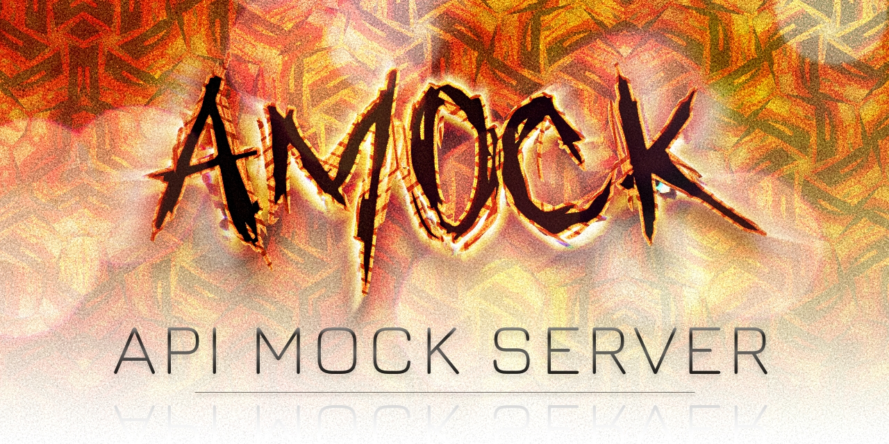

# Amock

### API Mock Server

Amock is a simple API mock server that uses JSON files to define entities from which it auto-generates endpoints. It is useful for front-end developers who need to work with a back-end API that is not yet available.

<!-- TOC -->
* [Amock](#amock)
    * [API Mock Server](#api-mock-server)
  * [Instalation](#instalation)
    * [npm (macOS, Linux, Windows)](#npm-macos-linux-windows)
    * [Homebrew (macOS)](#homebrew-macos)
    * [Manually download from releases (macOS, Linux, Windows)](#manually-download-from-releases-macos-linux-windows)
      * [1. Move the binary to `/usr/local/bin` or some other folder in your PATH:](#1-move-the-binary-to-usrlocalbin-or-some-other-folder-in-your-path)
        * [macOS/Linux](#macoslinux)
        * [Windows](#windows)
      * [2. Add the directory to your PATH:](#2-add-the-directory-to-your-path)
        * [macOS/Linux](#macoslinux-1)
        * [Windows](#windows-1)
          * [With GUI (recommended)](#with-gui-recommended)
          * [With PowerShell](#with-powershell)
    * [Build from source (macOS, Linux, Windows)](#build-from-source-macos-linux-windows)
      * [macOS/Linux](#macoslinux-2)
      * [Windows](#windows-2)
        * [With GUI (recommended)](#with-gui-recommended-1)
        * [With PowerShell](#with-powershell-1)
  * [Usage](#usage)
    * [Configuration](#configuration)
    * [Entity files](#entity-files)
      * [Defining properties](#defining-properties)
        * [Required and nullable properties](#required-and-nullable-properties)
        * [Types](#types)
    * [Running the server](#running-the-server)
  * [Inspiration](#inspiration)
  * [License](#license)
<!-- TOC -->

## Instalation

### npm (macOS, Linux, Windows)

```bash
npm install -g amock-cli
```

### Homebrew (macOS)

```bash
brew install matronator/tap/amock
```

### Manually download from releases (macOS, Linux, Windows)

Go to the [releases page](https://github.com/matronator/amock/releases/latest) and download the latest version for your OS. Extract the files and do either one of these:

1. Move the binary to a folder in your `$PATH`, or...
2. Add the folder to your `$PATH`

#### 1. Move the binary to `/usr/local/bin` or some other folder in your PATH:

##### macOS/Linux

```bash
sudo mv path/to/extracted/binary/amock /usr/local/bin
```

##### Windows

```txt
move path\to\extracted\binary\amock.exe C:\path\to\bin
```

#### 2. Add the directory to your PATH:

First move the extracted binary to some permanent folder. Then add the directory to your PATH by running:

##### macOS/Linux

```bash
export PATH=$PATH:path/to/extracted/binary
```

To make this permanent, add this line to your `~/.bashrc` or `~/.zshrc` or `~/.profile` file.

##### Windows

###### With GUI (recommended)

1. Open `"My Computer" > "Properties" > "Advanced" > "Environment Variables" > "Path"`
2. Add the path to the `amock.exe` file to the list
3. Restart your terminal

###### With PowerShell

```powershell
$PATH = [Environment]::GetEnvironmentVariable("PATH", "Machine")
$amock_path = "C:\path\to\amock"
if( $PATH -notlike "*"+$amock_path+"*" ){
    [Environment]::SetEnvironmentVariable("PATH", "$PATH;$amock_path", "Machine")
}
```

### Build from source (macOS, Linux, Windows)

> [!IMPORTANT]
> Requires Go 1.16 or later

#### macOS/Linux

```bash
git clone https://github.com/matronator/amock.git
cd amock
go build -o cmd/amock -ldflags="-s -w" .
sudo mv cmd/amock /usr/local/bin
# have to use sudo because /usr/local/bin is protected
```

Make sure that /user/local/bin is in your PATH. If not edit your `~/.bashrc` or `~/.zshrc` or `~/.profile` and add the following line:

```bash
export PATH=$PATH:/usr/local/bin
```

#### Windows

```bash
git clone https://github.com/matronator/amock.git
cd amock
go build -o cmd/amock.exe -ldflags="-s -w" .
```

Next move the `amock.exe` to some permanent location and add it to your PATH with either the GUI or PowerShell:

##### With GUI (recommended)

1. Open `"My Computer" > "Properties" > "Advanced" > "Environment Variables" > "Path"`
2. Add the path to the `amock.exe` file to the list
3. Restart your terminal

##### With PowerShell

```powershell
$PATH = [Environment]::GetEnvironmentVariable("PATH", "Machine")
$amock_path = "C:\path\to\amock"
if( $PATH -notlike "*"+$amock_path+"*" ){
    [Environment]::SetEnvironmentVariable("PATH", "$PATH;$amock_path", "Machine")
}
```

## Usage

After installing you can simply start the server by running:

```bash
amock
```

You can also optionally specify the host you want to use for the server by supplying it as the first argument like this:

```bash
amock localhost:1234
```

This will overwrite the host and port set in your config file and start the server on `localhost:1234`.

### Configuration

You need to create a config file for the server to be of any use. The config file is a JSON/YAML/TOML file that defines the entities that the server will mock and some other settings. Valid config file names are these in order of priority (the first one found will be used):

```json
[".amock.json", ".amockrc.json", ".amock.json.json", ".amock.json.yml",
".amock.json.yaml", ".amock.json.toml", "amock.config",
"amock.json", "amock.yml", "amock.yaml", "amock.toml"]
```

Here is an example of a config file:

```json5
// .amock.json
{
  "host": "localhost", // default is localhost 
  "port": 8080, // default is 8080
  "entities": [ // default is empty
    "user.json", // relative path to the entity file
    "post.json"
  ],
  "dir": "relative/path/to/entities/dir", // default is empty
  "initCount": 20 // default is 20 - number of entities to generate on server start
}
```

Alternatively you can define environment variables or an `.env` file to configure the server. The environment variables (with defaults) are:

```dotenv
AMOCK_HOST=localhost
AMOCK_PORT=8080
AMOCK_DIR='path/to/entities' # default is empty
AMOCK_ENTITIES='[user.json, post.json]' # default is empty
AMOCK_INIT_COUNT=20
```

You must set either `entities` where you list individual files or `dir` where you specify a directory containing the entity files and all valid files in that directory will be used.

You can set both but files from `entities` will override files with the same name found in the `dir` directory. Both `entities` and `dir` are optional but at least one must be set and paths in both are relative to the config file.

### Entity files

Entity files are JSON files that define the structure of the entities that the server will mock. The name of the file will be the name of the entity and the name of the endpoints.

Here is an example of an entity file:

```json5
// user.json
{
  "id": "id.sequence",
  "name!": "string.firstname",
  "surname!": "string.lastname",
  "age": "number.int:18-64",
  "birthday": "date:yyyy-MM-dd",
  "money": "number.decimal:2,0-10000",
  "email": "string.email",
  "password": "string.password",
  "username": "string.username",
  "city?": "string.city",
  "street?": "string.street",
  "country?": "string.country:short",
  "role": "enum:admin,user,moderator",
  "is_active": "bool",
  "token": "string",
  "created_at": "date.timestamp",
  "updated_at": "date.timestamp"
}
```

This would generate an entity object `user` looking like this:

```json5
{
  "id": 1,
  "name": "Hal",
  "surname": "Kling",
  "age": 27,
  "birthday": "1996-10-29",
  "money": 7170.82,
  "email": "lucianonienow@schinner.org",
  "password": "jcFWmf$y4gOp@&6o",
  "username": "Toy3451",
  "city": "Chesapeake",
  "street": "981 South Keyston",
  "country": "AL",
  "role": "user",
  "is_active": true,
  "token": "p?sb",
  "created_at": 1168432992,
  "updated_at": 701208326
}
```

#### Defining properties

When defining your entity you can use the following types and the server will generate the data for you. Data is generated once on server start if not already in store and whenever a new entity is created without specifying the property (if it's not required).

The syntax for defining a property is 

`"<name>": "<type>.<subtype?>:<options>"`

where `name` is the name of the property, `type` is the type of the property followed by a dot and an optional `subtype` and optionally a colon followed by `options` for the type.

##### Required and nullable properties

If the property name ends with `!` it is required and must be present in the request. If it ends with `?` it is nullable meaning that you can send a `null` value for it in your request.

> [!TIP]
> You can check some examples of how to define entities in the [examples](/examples) folder.

##### Types

You can use the following types and subtypes to define your properties:

```go
"string": {
    "":           Random string, // no subtype
    "name":       Full name,
    "firstname":  First name,
    "lastname":   Last name,
    "email":      Email address,
    "url":        Url,
    "ip":         Ip,
    "ipv6":       Ipv6,
    "username":   Username,
    "password":   Password,
    "phone":      Phone number,
    "zip":        Zip,
    "country":    Country, // with following options
          ["short":   Short country code],
    "city":       City,
    "street":     Street,
    "streetName": Street name,
    "state":      State, // with following options
          ["short":   Short country code],
    "company":    Company name,
    "bitcoin":    Bitcoin address,
    "color":      Color, // width following options
          ["":     Color name in English], // default
          ["hex":  Color in hex format],
          ["safe": Web safe color],
          ["rgb":  Color in RGB format],
    "word":       Random word,
    "sentence":   Random sentence,
          [int:  Number of words in sentence], // default 3
    "paragraph":  Random paragraph,
          [int:  Number of paragraphs], // default 3
},
"number": {
    "":        Random number, // no subtype
    "int":     Random integer,
    "decimal": Random decimal number,
    "float":   Random float,
    "range":   Random float in Range,
},
"date": {
    "":          Date, // no subtype, but you can specify the format
        [string:  Date format (e.g. yyyy-MM-dd)],
    "timestamp": Timestamp,
    "day":       Day,
    "month":     Month,
    "year":      Year,
    "weekday":   WeekDay,
    "future":    Future,
    "past":      Past,
},
"bool": true or false,
"enum": Pick a random item from the list provided in options, separated by commas,
"id": {
    "":         Sequential ID, // no subtype
    "sequence": Sequential ID,
    "uuid":     UUID,
},
```

### Running the server

After you have your config file and entity files set up you can start the server by running:

```bash
amock
```

Which, if we used the `user` entity from above, would generate the following endpoints:

- `GET /users` - returns an array of users
- `GET /users/:id` - returns a single user
- `POST /users` - creates a new user or updates existing one if the ID matches one already in the database. You can post a single user or a collection as an array
- `PUT /users` - same as POST for now
- More endpoints will be added in the future...

You can access the server at `http://localhost:8080` or whatever host and port you set in your config file. You can access the endpoints with a REST client like Postman or Insomnia or even in a browser.

Whatever operations you do on the entities will be saved in a file and will be available even after you restart the server.

## Inspiration

This project was inspired by [json-server](https://github.com/typicode/json-server) and uses the [gofakeit](https://github.com/brianvoe/gofakeit) library for generating data.

## License

Check the [LICENSE](LICENSE) file for more information.

---

**[Matronator](https://matronator.cz) © 2024**
